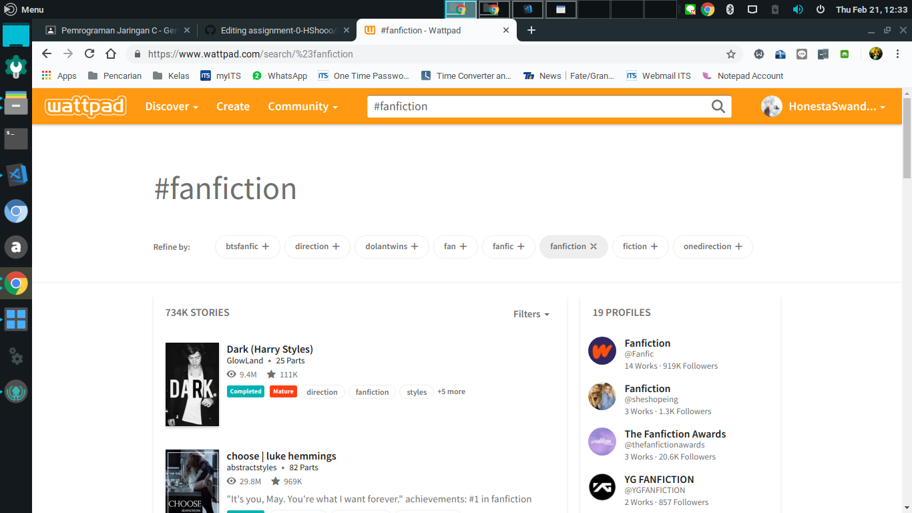

# assignment-0-Honesta Swandaru

Nama  : Honesta Swandaru
 
NRP   : 0511164000055

<h2>The Problem with my Powebank</h2>
So, a few months ago I bought a powerbank and the first time i see it, i've already annoyed with the design. If you look in video, you can see that's it's just a black powebank, a flashlight and a lamp to let us know when we need to recharge the powebank. But, a thing i've annoyed been is we don't know how much like "it's still 20 percent or 50 percent" like that. So, i've always caution when the lamp is red - but i don't know how much. maybe it's still 35 percent or 20 percent that make it usable to charging in emergency way. When i search about the lamp in internet, i can't find about it. 

<h2> Solution </h2> 
Maybe you can re-design it by using a parameter lamp like how much it is or AT LEAST give information about the lamp. 

<h2>My Problem with Wattpad</h2> 

Well, I'm a writer (especially a fanfiction one) so i know a few web to reading. But, from every web i know for reading and posting the fanfiction, the worst one is wattpad. Why? because you can't search what you needed. It's still using tags and don't do the sorting based on type of the post. And you just do the single tags only, and no filter. I've used it a few years and it's still made me annoyed for some reason. And we don't know how that the story is crossover or not. 

<h2>Solution</h2>
So, the first one we need sorting, not tag. The second and third one, if wattpad still using the tags, at least make it two like in AO3 one which can using two tags or more. 
  
<h2>y Latest Problem with SPOJ</h2> 

Well, it's my problem this week with SPOJ. I felt very annoyed today because i can't signed in because i forgot the password. And i felt annoyed to Myself and SPOJ too because why am i forgotten my usenames and why SPOJ requires an username to recover my account too? in many websites you just using email only if the username os forgotten. but not in SPOJ 

<h2>Solution</h2> 
Please just using an email for recovery. Maybe it's riskier but what happened if we forgotten usernames too?
  
